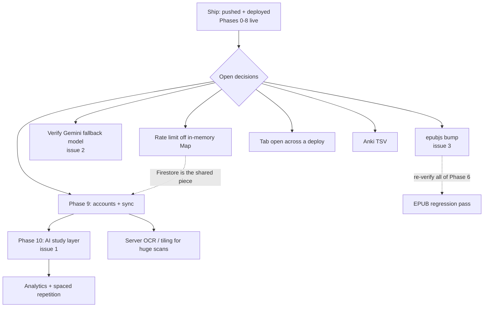

# Decisions

Every fork in the road, in the order it was reached: what was chosen, what was
**not**, and why. Then everything still ahead — the open decisions, what gates
each, and the branches under it.

The other docs answer different questions. `AGENTS.md` says how the system fits
together, `PROGRESS.md` says what was built and how it was proven, `ROADMAP.md`
says what is planned. This one says **why it is the way it is, and what it could
have been instead** — which is the part that is lost first.

**How to read the tables.**

- **Who** — `you`: you chose it when asked. `build`: an engineering call made
  while building, with the reason recorded. `earlier`: made before this record
  began (Phases 0–4); the commit and docs preserve the reasoning but not who
  weighed in, so nothing here claims to know.
- **Not chosen** is only filled where the record actually names the alternative.
  A dash means nothing else was weighed *on the record* — not that nothing else
  existed.
- **Source** is where to read more: a commit hash, or a doc and section.

Dates: Phases 0–4 landed 7–13 Sep 2026. Everything from Phase 5 onward was built
and shipped on 21 Sep 2026.

---

## Contents

1. [Foundations](#1-foundations-phase-0-7-sep)
2. [Phase 1 — PDF render and the coordinate system](#2-phase-1--pdf-render-and-the-coordinate-system)
3. [Phase 2 — Magnifier](#3-phase-2--magnifier)
4. [Phase 3 — Annotations and saving](#4-phase-3--annotations-and-saving)
5. [Phase 4 — Definitions, search, first deploy](#5-phase-4--definitions-search-first-deploy)
6. [Phase 5 — OCR](#6-phase-5--ocr)
7. [Phase 6 — EPUB](#7-phase-6--epub)
8. [Deciding what was left](#8-deciding-what-was-left)
9. [Phase 7 — Release hardening](#9-phase-7--release-hardening)
10. [Phase 8 — Export](#10-phase-8--export)
11. [Shipping, and what shipping found](#11-shipping-and-what-shipping-found)
12. [How the work is done](#12-how-the-work-is-done)
13. [What is still ahead](#13-what-is-still-ahead)
14. [Decisions that are provisional](#14-decisions-that-are-provisional)

---

## 1. Foundations (Phase 0, 7 Sep)

| # | Decision | Chosen | Not chosen | Why | Who | Source |
|---|---|---|---|---|---|---|
| 0.1 | UI framework | Svelte 5 with runes | React | A virtual DOM is the wrong tool for 60fps pointer work | earlier | README, AGENTS *Stack* |
| 0.2 | App shell | Plain Vite SPA | SvelteKit | No server rendering and no routing needed | earlier | README, AGENTS |
| 0.3 | State | One runes store, `reader.svelte.ts` | A state library | Runes already cover it | earlier | README, AGENTS |
| 0.4 | Where documents live | The browser (IndexedDB via Dexie); never uploaded | Server storage | The product's headline claim: local-first | earlier | README *Privacy* |
| 0.5 | Coordinates | Every geometric value stored in **page units** (PDF user space, origin bottom-left) | Screen or CSS pixels | So a mark survives zoom, spread and DPI changes. Invariant 1 | earlier | AGENTS inv. 1 |
| 0.6 | Format handling | A `DocAdapter` interface; the shell never knows the format | Branching on format in the UI | Invariant 2 (**narrowed in 6.2**) | earlier | AGENTS inv. 2 |
| 0.7 | Saving | Explicit save (Ctrl+S); autosave writes a *separate* draft that is offered, never merged | Autosave straight into the saved state | Otherwise "saved" stops meaning anything. Invariant 6 | earlier | AGENTS inv. 6 |
| 0.8 | Storage access | One module, `storage.ts`, is the only thing that touches Dexie | Storage calls scattered through components | Cloud sync later should be one file plus a merge function, not a migration. Invariant 7 | earlier | AGENTS inv. 7 |
| 0.9 | Annotation identity | Stable `id` and `updatedAt` on every annotation | Positional ids | Makes last-write-wins merging a function rather than a migration | earlier | AGENTS inv. 7 |
| 0.10 | Build order | Phases ordered so each is *proven*, not merely written; Phase 1 gates the rest | Building features in parallel | A coordinate bug in Phase 1 would silently corrupt everything above it | earlier | ROADMAP intro |
| 0.11 | Format detection | Recognises image and EPUB before their adapters exist | Adding detection with each adapter | The shape is committed so the shell never learns what it is reading | earlier | ROADMAP *Known limitations* (as it stood at Phase 4) |
| 0.12 | Unfinished work | A `TODO(phase-N)` next to the real signature | Leaving stubs shapeless | The shape is committed even when the body is not | earlier | AGENTS *Conventions* |

## 2. Phase 1 — PDF render and the coordinate system

| # | Decision | Chosen | Not chosen | Why | Who | Source |
|---|---|---|---|---|---|---|
| 1.1 | Page geometry API | `getViewport(i): Promise<PageGeometry>` | `getPageSize` | Every layer above the canvas needs the full transform, rotation and y-flip included | earlier | `8cebca7` |
| 1.2 | Text layer | Built from our own `TextItem[]` | pdf.js's `TextLayer` class | That one consumes pdf.js `TextContent`, which an OCR'd page will not have — it would force exactly the "is this OCR" branch the adapter boundary exists to prevent | earlier | `8cebca7` |
| 1.3 | Positioning | Computed once in scale-1 CSS px, scaled by one `--z` property | Recomputing every span per zoom | A zoom becomes one property write, not a relayout of a thousand spans | earlier | `8cebca7` |
| 1.4 | pdf.js loading | Reached only through `await import()` | A static import | Splits it into its own chunk with no bundler config, and keeps the module importable under `node --test` | earlier | `8cebca7` |
| 1.5 | Rotated text | Reduced to its axis-aligned box | Carrying an angle through every consumer | Enough for selection, search and the band magnifier | earlier | `PdfAdapter.ts` |
| 1.6 | Also added | Spread and reading-direction toggles, settings persistence, fit-to-height on open | Leaving settings without a UI | They existed with no way to change them; an A4 spread at scale 1 opens wider than most windows | earlier | `8cebca7` |

## 3. Phase 2 — Magnifier

| # | Decision | Chosen | Not chosen | Why | Who | Source |
|---|---|---|---|---|---|---|
| 2.1 | Method | Rasterise the focused page **once**, off-DOM, at `zoom × magFactor`; each frame is one `drawImage` crop | Re-rendering per frame; CSS scaling | Rendered at exactly the magnification shown, so both modes are a 1:1 device-pixel blit — nothing is resampled and a frame is nearly free | earlier | `001dd33` |
| 2.2 | Two modes | One crop pipeline serves lens and band | Two geometries with two pipelines | The 1:1 blit makes them the same operation | earlier | `001dd33` |
| 2.3 | Render cancellation | Keyed by **canvas** | Keyed by page index | The magnifier rasterises the same page into its own canvas; keying by page had it cancelling the visible page. The real rule was always one render per canvas | earlier | `001dd33` |
| 2.4 | Layout reads | Bounding box cached, invalidated on zoom, page, scroll, resize | `getBoundingClientRect()` on every pointermove | It forced a layout per frame on the one path that must not | earlier | `001dd33` |
| 2.5 | Text extraction | Shared through `pageText()` | Each layer asking the adapter and caching its own copy | One path, one cache | earlier | `001dd33` |
| 2.6 | Memory | One hi-res canvas at a time, released on page change | Keeping one per page | At 2.5× an A4 page is ~20MB. Invariant 5 | earlier | AGENTS inv. 5 |
| 2.7 | Hot paths | Cursor, in-flight ink and crop rects never go through reactive state | Routing them through the store | It is the one mistake that makes the app feel slow. Invariant 3 | earlier | AGENTS inv. 3 |

## 4. Phase 3 — Annotations and saving

| # | Decision | Chosen | Not chosen | Why | Who | Source |
|---|---|---|---|---|---|---|
| 3.1 | Layer conflicts | Routed **by tool, in markup**: only the active tool's surface exists | Resolving by z-index | Invariant 4. Highlight and underline are *text* tools because the browser's own selection produces their geometry | earlier | `6f9d7a6` |
| 3.2 | Erase | One uniform layer of focusable buttons over each mark's bounds | Click handlers on three different shapes | Also fixes a thin ink stroke being nearly impossible to click | earlier | `6f9d7a6` |
| 3.3 | Ink storage | Stays in page units end to end; the SVG is handed the viewport's matrix | Converting every point on every render | A stroke is hundreds of points | earlier | `6f9d7a6` |
| 3.4 | Ink library | `perfect-freehand`, filling the stroke's *outline* | A stroked polyline | Lets pressure vary width along a stroke | earlier | `ink.ts` |
| 3.5 | Drafts | Autosave every 30s to a separate table, *offered* on reopen | Merging silently | Invariant 6 | earlier | `6f9d7a6` |
| 3.6 | Failed saves | Leave `dirty` set | Clearing it regardless | A failure that clears the flag is silent and loses work — this is how bug 3.7a was noticed at all | earlier | AGENTS inv. 8 |
| 3.7 | Four bugs; three became invariants | **(a)** Everything bound for storage goes through `$state.snapshot` — inv. 8. **(b)** Nothing renders before its viewport exists — inv. 9. **(c)** `mix-blend-mode` on the layer, not the mark, and `.page` is `transform-style: flat` — inv. 10. **(d)** `getCoalescedEvents()` can return an empty list, so the fallback is on emptiness, not on a missing method — fixed, but not promoted to an invariant | Patching each symptom | Each took long to find because the symptom was nowhere near the cause | earlier | `6f9d7a6`, `05f9ec0` |
| 3.8 | Two tabs on one document | **Left unfixed** and recorded as a known limitation | Fixing it in Phase 3 | Out of scope while the app was single-device. *Reversed in 9.2* | earlier | `6f9d7a6` |
| 3.9 | Docs | Three docs with three jobs: AGENTS (architecture), PROGRESS (what was proven), ROADMAP (the plan) | One combined doc | So none of them drift | earlier | `05f9ec0` |

## 5. Phase 4 — Definitions, search, first deploy

| # | Decision | Chosen | Not chosen | Why | Who | Source |
|---|---|---|---|---|---|---|
| 4.1 | Search | Flatten a page's runs into one string with a map back to the runs; fold (NFKD, lowercase, collapse); search the folded copy; walk both maps home | Searching each run separately; a search library | A page's text is not a string: it is hundreds of runs split at font changes, wrapped across lines, with words cut by a hyphen | earlier | `0c3371f` |
| 4.2 | Joining runs | A space only where there is a real horizontal gap; a trailing hyphen at a line break is dropped | Always joining with a space | pdf.js splits a run at every font change, so a bolded syllable mid-word arrives as two touching runs | earlier | `search.ts` |
| 4.3 | Search hits | A transient inert layer that never touches the annotations store | Storing hits as annotations | A hit must not be saveable or erasable | earlier | `0c3371f` |
| 4.4 | Definition order | cache → dictionaryapi.dev → `/api/define` | Model-first | The dictionary is keyless and instant; a cache hit costs nothing | earlier | `0c3371f` |
| 4.5 | The privacy boundary | **Code, not policy.** `MAX_CONTEXT` (300 chars) bounds what is assembled, and the function *refuses* anything longer | Truncating on the server; a written policy | Refusing means the two sides cannot drift apart quietly. Invariant 11 | earlier | `0c3371f`, AGENTS inv. 11 |
| 4.6 | Backend framework | **None.** One `onRequest` function | Hono (what the roadmap said) | For one POST route it was a dependency plus a real hazard: `firebase-functions` consumes the request stream to fill `req.body`, so a fetch-style adapter waits forever | earlier | `0c3371f` |
| 4.7 | Network failures | 8s deadline on every request; an unreachable dictionary falls through to the model | No timeout | The browser found a hung fetch leaving the card on "Looking up…" for 38s | earlier | `0c3371f` |
| 4.8 | Cloud region | `asia-south1` (Mumbai) | A transatlantic default | The reader is in India. It is named in two places that must agree — a mismatch 404s rather than failing loudly | earlier | `84d2141` |
| 4.9 | Project link | `.firebaserc` committed | Leaving it out | It holds a project id and nothing else, and committing it means the link survives a fresh clone | earlier | `84d2141` |
| 4.10 | Billing plan | Firebase **Blaze** (pay-as-you-go) | Spark | Not optional: gen2 functions are unavailable on Spark, and a Spark function cannot make outbound requests — so the Gemini call would fail regardless | earlier | DEPLOY step 2 |
| 4.11 | Gemini key tier | A **paid** key | The free tier | On the paid tier Google does not use prompts to improve its products; on the free tier it does, and the app tells its users their reading stays private | earlier | DEPLOY step 3, README |
| 4.12 | Cost guards | `maxInstances: 3`, 20s timeout, 256MiB, per-IP rate limit, a **$1** budget alert, a 1-day Artifact Registry cleanup policy | Uncapped | A bug should not become a bill | earlier | DEPLOY *Cost* |
| 4.13 | Rate limiter | An in-memory `Map`, so per instance | Firestore | Enough to stop a runaway loop; marked `ponytail` with its ceiling. *Still open — see 9.4* | earlier | `functions/src/index.ts` |
| 4.14 | Model id | `gemini-2.5-flash` → **`gemini-3.6-flash`** | Staying on 2.5 | It was closed to new projects and answered 404. A model id is a dependency with a support window, not a constant | earlier | `4800a92` |
| 4.15 | Output budget | `maxOutputTokens` 200 → **800** | Keeping 200 | Thinking tokens are charged against it; 200 would have been spent reasoning and returned an *empty* answer, misdiagnosed as "no definition" | earlier | `4800a92` |
| 4.16 | Reading the answer | The first part that is not flagged `thought` | `parts[0]` | A thinking model returns its reasoning in the same array | earlier | `4800a92` |
| 4.17 | Thinking level | **`minimal`** | `low` | Measured: 4.2–4.8s at low, 1.8–2.2s at minimal, and the answers were *more* specific. `minimal` is the floor — 3.x cannot turn thinking off | earlier | `9ac1073` |

## 6. Phase 5 — OCR

| # | Decision | Chosen | Not chosen | Why | Who | Source |
|---|---|---|---|---|---|---|
| 5.1 | Scope | The full roadmap item: OCR worker, scanned-PDF handoff, `ImageAdapter`, progress UI | Scanned PDFs only; `ImageAdapter` only | Scans are the common case, and images share the same OCR path | **you** | session |
| 5.2 | OCR assets | **Self-hosted** in `public/tessdata/` (~5.7MB committed) | tesseract's CDN; self-host the core but CDN the model | Keeps "exactly two things cross the network" literally true, and OCR works offline | **you** | session, `229dc11` |
| 5.3 | Assets: postinstall copy script | Committed the files | A `postinstall` script | It adds a build step, needs the network at install, and fails silently on a fresh clone. 7MB committed is cheaper | build | plan |
| 5.4 | The worker | tesseract's own `createWorker()`; `lib/tesseract.ts` is a thin owner | A hand-written `workers/ocr.worker.ts` (the roadmap's wording) | `createWorker()` already owns a Web Worker — ours would be a worker inside a worker | build | `ac1837f` |
| 5.5 | Box → page units | `screenToQuad`, the same code the selection path uses | A second conversion | Invariant 1 holds on a scan without a second conversion to get wrong | build | `ac1837f` |
| 5.6 | Raster scale | **Measured** off the canvas | Assumed from `OCR_SCALE × dpr` | `renderPage` rounds; a conversion that recomputes what it could read is one refactor from putting every word in the wrong place | build | `ac1837f` |
| 5.7 | Line ids | tesseract's own line grouping | `groupByLine` (1.5pt baselines) | A scan's baselines wobble with the paper; at 216dpi that clears 1.5pt easily | build | `ac1837f` |
| 5.8 | Word heights | The **line's** vertical extent | Each word's own ink box | pdf.js reports a run's height as the font's, uniform along a line, and everything downstream is built on that. Ragged boxes turned a highlight into uneven tiles | build | `ac1837f` |
| 5.9 | Resolution | `OCR_SCALE = 3` (216dpi) | Higher or lower | tesseract wants 150–300 and the cost is quadratic. The tuning knob | build | `PdfAdapter.ts` |
| 5.10 | The wasm core | The **single-file** `.wasm.js` build | The two-file build (1MB smaller) | The two-file loader resolves its sibling `.wasm` against a script directory that is empty inside tesseract's worker, and dies. Found by the browser | build | `229dc11` |
| 5.11 | Core variants | **SIMD only** | Shipping all three tesseract probes for | Naming one core skips the probe; SIMD has been universal since 2021 | build | `public/tessdata/README.md` |
| 5.12 | Language model | English, `tessdata_fast` | `_best`; other languages | Roughly twice the speed for text that is about to be searched, not published | build | `public/tessdata/README.md` |
| 5.13 | Worker lifetime | **Never terminated**; jobs queued through one promise chain | Terminating on close; parallel jobs | A singleton, unlike the magnifier's per-page canvas. Termination would trade bounded ~30MB for a 2s cold start | build | `tesseract.ts` |
| 5.14 | OCR progress | In the store; `tesseract.ts` reached only by dynamic import | Progress beside the worker | A single static import anywhere pulls 5MB into the entry bundle | build | `ac1837f` |
| 5.15 | `getTextItems` return | `{ items, source }` | `TextItem[]` alone | Lets `pageText` record real provenance and finally gives `ocrDone` a writer. A bookkeeping field, never a branch | build | `ac1837f` |
| 5.16 | `pageText` | Deduped **in flight** | Relying on the Dexie cache | The cache only dedupes callers arriving after the first finishes; the layers ask in the same tick, and a duplicate OCR pass costs seconds | build | `ac1837f` |
| 5.17 | Selecting two words | A non-breaking space between spans, using search.ts's own gap rule | A plain space; a second rule | A plain space is the only in-flow content and is collapsed away; one rule keeps the selected and searched strings in agreement | build | `bf2a3c3` |
| 5.18 | `GAP_RATIO` | **0.25 → 0.12** | Leaving it | It sat inside the distribution it was meant to split (real spaces measured 0.242–0.636), so one pair in 24 read `Everyquad`. Calibrated on **one** 21pt serif page — see §14 | build | `bf2a3c3` |
| 5.19 | Selection merge tolerance | Scales with the text's own height | The fixed 1.5-unit tolerance | DOM rects are rounded and dividing by zoom magnifies that; on an image a page unit is a pixel, not a point | build | `bf2a3c3` |
| 5.20 | Line endings | `.gitattributes`: `public/tessdata/** -text` | Leaving git to normalise | A CR inside the base64-inlined wasm corrupts it on checkout | build | `229dc11` |
| 5.21 | Asset caching | One week | Immutable, like `/assets/**` | The filenames are not content-hashed, so an upgrade would otherwise be invisible | build | `firebase.json` |
| 5.22 | The "Gemini problem" | Filed **#1** (AI search over the document) and **#2** (model-id expiry) | Also filing the 2s AI latency | Search never touched Gemini; the two real deferred items were these. Latency stays a documented limitation | **you** | session |

## 7. Phase 6 — EPUB

| # | Decision | Chosen | Not chosen | Why | Who | Source |
|---|---|---|---|---|---|---|
| 6.1 | Reading surface | epub.js's **own** surface inside the existing shell | Leaves, curl and perspective around epub.js content; flat two-column pages | Honest about the difference, and no fight with the iframe. Costs the "book in hand" feel for EPUB | **you** | session |
| 6.2 | The architecture | Two shells, one store. `EpubAdapter` does **not** implement `DocAdapter`; `ReaderShell` branches once, for the viewport. **Invariant 2 narrowed** to "the shell never knows which *paged* format it is reading" | Widening `DocAdapter` with a `kind` flag and optional members | Reflowable text has no viewport, raster or page unit. A one-interface design would be optional members all the way down, and every consumer would branch anyway | build | `4f30efb` |
| 6.3 | `openDocument` | Returns a union: `paged` or `reflowable` | One interface spanning both | The branch is made once, where it can be seen | build | `adapters/index.ts` |
| 6.4 | Tools | Highlight, underline, **notes anchored to a CFI**, erase | Also ink | A stroke has no stable point to pin to once the font changes. Pen is disabled, with an explanation | **you** | session |
| 6.5 | Scope | Chapter nav + position memory; **font size in place of the magnifier**; in-document search; selection → definition | Leaving any of them out | An iframe cannot be rasterised to a canvas, so the magnifier's blit has nothing to blit | **you** | session |
| 6.6 | Position model | Generate `book.locations` once and **cache it in Dexie** | Chapter + CFI only, no index; chapters first with the index built in the background | A real percentage, stable search ordering, and a "page N of M" that survives font changes. Reuses Phase 5's pattern for slow first-open work | **you** | session |
| 6.7 | Marks | Drawn by **epub.js's annotations API**; we store `{id, cfi, type, color}` | Our own overlay built from `getRange(cfi).getClientRects()` | epub.js repaints on reflow, resize and section change. Building it ourselves means owning repaint correctness forever, for a cosmetic match | build | `4f30efb` |
| 6.8 | Search | Reuse `normalize`, `findAll`, `sentenceAround`; replace only the geometry half (offsets → CFI). `findAll` narrowed from `Flat` to a plain string | A second search stack | One `MAX_CONTEXT` — the privacy boundary — instead of two copies that could drift | build | `9ce7d15` |
| 6.9 | Definition context | `DefinitionPopup` cuts its own sentence from section text handed to it | The caller supplying the sentence | The 300-char cap stays in the one file that promises it | build | `4f30efb` |
| 6.10 | Annotation `pageIndex` | The **spine index** | A new field | Keeps the existing `[docId+pageIndex]` index meaningful; no Dexie migration | build | plan |
| 6.11 | Stale marks after a font change | Remove and re-add the marks on a **350ms timer** after the change | Hanging it on `relocated`; a `ResizeObserver` | `relocated` fires while columns are still settling; the iframe's box never changes size, only its scroll width, so an observer sees nothing. Marked `ponytail` | build | `4f30efb` |
| 6.12 | Note marker | Styled in **our** stylesheet with `:global` | A theme rule inside the iframe | epub.js creates the `<a>` with the iframe's document but appends it to ours | build | `4f30efb` |
| 6.13 | Erase layer crash | Gated `targets` on `vp` | Wrapping the markup | One guard where every erase box routes through; pre-existing, found by switching documents mid-erase | build | `3611547` |
| 6.14 | EPUB scripts | `allowScriptedContent: false` | Allowing them | One less thing running from a file the reader dropped in | build | `EpubAdapter.ts` |

## 8. Deciding what was left

| # | Decision | Chosen | Not chosen | Why | Who | Source |
|---|---|---|---|---|---|---|
| 8.1 | Which tracks to scope | **All four**: release hardening, sync, the AI layer, export | A subset | — | **you** | session |
| 8.2 | How far privacy bends for sync | **Marks only.** Annotations, position and the lookup cache sync; the file never leaves the device and is matched across machines by a content hash | Full sync including documents; full sync, end-to-end encrypted | Keeps "the file is never uploaded" literally true, costs far less storage, and is a much smaller surface to get wrong | **you** | session |
| 8.3 | AI features and consent | A separate, **explicit, per-document opt-in** | Inheriting consent from signing in | RAG means shipping text, which is exactly what invariant 11 exists to prevent | **you** | session (follows from 8.2) |

## 9. Phase 7 — Release hardening

| # | Decision | Chosen | Not chosen | Why | Who | Source |
|---|---|---|---|---|---|---|
| 9.1 | A retired Gemini model | Return Google's status and reason in the 502 body; a **`404` only** retries once against `gemini-flash-latest`; report the *primary* failure if both fail | Retrying any failure; chaining models; a hardcoded second model id | A 429 or 500 would fail the same way twice and double the load on a service already refusing. An alias survives the next retirement without an edit. **Unverified against the real key** | build | `d90bf21` |
| 9.2 | Two tabs, one document | A **Web Lock**: one tab per document autosaves; the other says so and queues for it | A per-tab draft id | A per-tab id stops the overwrite but not the loss — recovery must still choose one draft to offer. The fix is one writer | build | `a96ddd7` |
| 9.3 | The lock's second half | The waiting tab is **promoted** when the owner closes | Giving up after the first refusal | Otherwise its banner would claim another tab owns autosave long after there is no other tab | build | `a96ddd7` |
| 9.4 | The rate limit | **Not done.** Held for a decision | Moving it to Firestore now | It means creating a database in the live project — provisioning, IAM and a billing surface | **you** | session |
| 9.5 | Keyboard access | `D` defines the current selection and moves focus into the card; the EPUB note editor takes focus and closes on Escape | Auto-focusing on every card | A flag that outlived a fruitless `D` would let a mouse-opened card yank focus mid-gesture, so the request travels with the call | build | `f4eb9ed` |
| 9.6 | A suspected keyboard bug | **Not fixed — disproved.** Keys inside epub.js's iframe were suspected of never reaching the shell | "Fixing" it anyway | Measured: three presses moved position by exactly 3% either way | build | `f4eb9ed` |
| 9.7 | Where the Gemini call lives | `functions/src/gemini.ts`, `fetch` injected; tests run on Node 24 and are excluded from the build | Testing through `index.ts` | No key, no network and no Firebase runtime needed | build | `d90bf21` |

## 10. Phase 8 — Export

| # | Decision | Chosen | Not chosen | Why | Who | Source |
|---|---|---|---|---|---|---|
| 10.1 | The PDF export | **Keep the text layer**: load the original and draw on it with `pdf-lib` | Rasterise each page and wrap the JPEGs (no new dependency); skip the PDF | An export you cannot search or select is a poor thing to send anyone. The first dependency added since the initial commit, reached only by `await import()` | **you** | session |
| 10.2 | Other exports | **Markdown of marks** | Anki TSV. (A real `.apkg` had already been ruled out in planning: it is a zipped SQLite database, and TSV is what Anki imports without ceremony) | Trivial and immediately useful | **you** | session |
| 10.3 | Marks in the PDF | **Drawn** (flattened) | Embedded PDF annotation objects | Right for something you send someone; the cost is that they cannot be edited elsewhere | build | `3533d0b` |
| 10.4 | Coordinates | None converted — page units *are* PDF user space | A conversion layer | Invariant 1 paying off | build | `3533d0b` |
| 10.5 | Ink | `flipPath` negates the y's | Passing the path through | `drawSvgPath` flips SVG space back, so our coordinates would mirror. Proven: 8,714 pixels changed where drawn, 0 at the mirror | build | `3533d0b` |
| 10.6 | Text under a mark | Reuse `flattenPage`; place characters proportionally; snap each edge to a word **by majority** (>50% covered) | Raw character cut; always snapping outward | The mark's edges came from real glyph widths, so a boundary can drift a character or two. Outward-only would drag a neighbour in | build | `63a9a80` |
| 10.7 | Non-Latin note text | Becomes `?` one character at a time | Embedding a font; throwing | A standard font throws outside WinAnsi; one stray glyph should not cost the whole note | build | `3533d0b` |
| 10.8 | What is exported | Marks **as they are now**, saved or not; the menu says so | The last saved state | Someone exporting mid-session expects what is on screen | build | `23bf611` |
| 10.9 | PDF export for EPUB and images | Not offered; the option is disabled with an explanation | Hiding it | There is no original PDF to draw on | build | `23bf611` |
| 10.10 | Ink in Markdown | Counted per page, not exported | Dropping it silently | A stroke has no text form, and silence would lose it without a trace | build | `63a9a80` |

## 11. Shipping, and what shipping found

| # | Decision | Chosen | Not chosen | Why | Who | Source |
|---|---|---|---|---|---|---|
| 11.1 | Phase 5 deploy | Hosting only | Rebuilding the function | It was untouched | build | `4f283c2` |
| 11.2 | Verifying a deploy | Check the **content type**, not the status code | A status check | The SPA rewrite answered the missing OCR asset `200 text/html`; a status check would have passed with nothing deployed | build | `4f283c2` |
| 11.3 | Pushing to GitHub | Pushed 13 commits, then later ones | Holding | GitHub was two phases behind | **you** | session |
| 11.4 | Deploying Phases 6–7 | Hosting **and** the function | Hosting only; hold | Puts EPUB and the keyboard fixes live and ships the Gemini fix | **you** | session |
| 11.5 | Deploying Phase 8 | Hosting; pushed | Push only; hold | The function was untouched | **you** | session |
| 11.6 | The `index.html` cache | `no-cache` for `/` and `/index.html`; hashed assets stay immutable | Leaving Firebase's 1-hour default | A cached `index.html` names chunks the new deploy deleted, and the SPA rewrite answers the missing URL with HTML that the `/assets/**` rule marks immutable for a year. Live since Phase 4; found only because a browser that had visited before hit it | build | `9473bd6` |
| 11.7 | Tab open across a deploy | **Left unsolved**, recorded in DEPLOY.md | Auto-reloading on a failed import | It would also throw away unsaved marks if it fired at the wrong moment | build | `9473bd6` |
| 11.8 | The `epubjs` advisory | **Filed as #3, then fixed** on `bugfix/epubjs-xmldom-advisory` with the override | `epubjs@0.4.2`; accepting and documenting it | It was filed on the belief that the only fix was a semver-major `epubjs` bump. **That was wrong**: `npm audit`'s suggested `0.4.2` is a March 2018 release, older than the 0.3.93 in use, and it depends on the ancient `xmldom@0.1.x`. The real fix is a one-line `overrides` entry, which passed everything and is now applied (see F3). Also found: xmldom is never invoked in a browser | **you** | session |

## 12. How the work is done

| # | Decision | Chosen | Not chosen | Why | Who |
|---|---|---|---|---|---|
| 12.1 | Commits | Several staged commits, each one coherent, with the reasoning in the body | One commit per phase | Each reads on its own and can be reverted alone | **you** |
| 12.2 | Attribution | **No Claude attribution lines**, ever — no `Co-Authored-By`, no "Generated with" | The default trailer | Stated twice; it outranks any default or reminder | **you** |
| 12.3 | Outward-facing actions | A push or a deploy waits for an explicit go | Doing them as a side effect | They are hard to take back | build |
| 12.4 | Proving a phase | In a **real browser**, with measured numbers against a rasterised target | Reading the screenshot | Geometry claims need something to be wrong against. Every phase since 1 found a bug this way that a typecheck could not | build |
| 12.5 | Tests | One runnable `node --test` check per non-trivial piece of logic; no framework, no fixtures | A test framework | Convention since Phase 0 | earlier |
| 12.6 | Recording limits | Every phase ends with its **known limitations** and the corrections it needed, including hypotheses that turned out wrong | Recording only successes | So the next session does not re-derive a dead end | build |
| 12.7 | Simplifications | Marked `ponytail:` with their ceiling and upgrade path | Silent shortcuts | So a corner cut is a recorded decision | build |

---

## 13. What is still ahead

Everything below is **undecided** unless it says otherwise. "Gate" is the thing
that has to be settled first. "Leaning" is an opinion, offered so the option has a
default — it is not a decision.

### 13.1 Dependency map

The dotted edges are the real coupling: the rate limit and sync both need
Firestore, so doing the rate limit first is groundwork for sync and not throwaway;
and the `epubjs` bump cannot be judged safe without re-running Phase 6.

### 13.2 Open decisions

| # | Item | Gate | Options | Leaning |
|---|---|---|---|---|
| F1 | **The rate limit** (9.4) | Are you willing to create a Firestore database in `readint-6b7d2`? | Firestore; a memory store such as Redis; an edge layer in front (API gateway / WAF); accept the Map. The real ceiling today is 3× the configured 20/min | Firestore — it is needed for sync anyway, so this is groundwork |
| F2 | **Exercise the Gemini fallback** (issue #2) | A way to make the primary 404 without breaking production | Temporarily deploy with a bogus primary id, watch the fallback run, redeploy; run the function in the emulator with a bad id; leave it untested and keep #2 open | The emulator route — it touches nothing live |
| F3 | ~~The `epubjs` advisory~~ (issue #3) — **decided and done** | — | Applied the override `"@xmldom/xmldom": "0.8.15"` (audit 0; suite, build and an EPUB session unchanged). Not taken: accept-and-document; wait for an epubjs release (none since 2022); `epubjs@0.4.2`, which is a 2018 downgrade | **Remaining: merge the PR and redeploy hosting**, since the bundled code changes. Severity was low regardless: xmldom is unreachable in a browser |
| F8 | **`functions/` dependency audit** | Whether 11 moderate transitive findings (all via `firebase-functions`) are worth a bump | `npm audit fix` for the two with a non-breaking fix (`express`/`qs`, `gaxios`/`uuid`); bump `firebase-functions` to 7.x (a semver-major, needs the function re-verified); accept | The non-breaking fixes first; treat the major bump as its own task |
| F4 | **A tab open across a deploy** (11.7) | Whether an interruption is acceptable | Auto-reload when idle and clean; a "new version — reload" notice; a service worker that owns versioning; keep the current behaviour | The notice — it never touches unsaved work |
| F5 | **Anki TSV** (10.2) | Whether flashcards are wanted without the AI layer | One card per highlight, TSV; or wait for the AI layer to generate better cards | Build the plain one; it is small and local |
| F6 | **Note text in the PDF export** (10.7) | Whether non-Latin notes matter | Embed a real font (a few hundred KB per export); keep `?` | Embed only when a non-Latin note is actually present |
| F7 | **Editable annotations in the PDF export** (10.3) | Whether the export is for sending or for continuing work elsewhere | Embedded annotation objects; keep drawing | Keep drawing unless someone asks |

### 13.3 Phase 9 — accounts and cross-device sync

**Decided (8.2):** marks only; documents stay local, matched by content hash.
Everything under it is open, and **this phase needs its own brainstorm** — it is
the first real backend and not an increment on what exists.

| # | Question | Options | Notes |
|---|---|---|---|
| S1 | Identity | Google sign-in; email link; anonymous first, upgrade later | Anonymous-first fits a local-first app: no account until you want a second device |
| S2 | What syncs | Annotations; reading position; the lookup cache; **settings** | Settings may be device-specific by nature (zoom, spread, magnifier) — open |
| S3 | Conflicts | Last-write-wins on `updatedAt` (the architecture is already prepared for it); a CRDT | LWW is cheap and the data is small; a CRDT is the answer if two devices editing the *same note text* becomes common |
| S4 | Deletions | Tombstones; hard delete | The store already tracks `deletedIds` locally. A hard delete would resurrect on the next merge |
| S5 | A mark for a document this device lacks | Hold it dormant until the file is added; show a shelf entry "add this file" | Content hash (SHA-256 via `crypto.subtle`) is what makes the match |
| S6 | Cost | Firestore free tier; the $1 budget alert as the guard | Every phase so far was costed against it |
| S7 | Interplay with the tab lock | The Web Lock is per *browser*, not per account | Two devices need a merge; two tabs need the lock. They are different problems |
| S8 | What "documents stay local" means for a phone | Re-add the file per device | The trade of choice 8.2 — worth stating to users |

### 13.4 Phase 10 — the AI study layer (issue #1)

Blocked on Phase 9. **Decided (8.3):** an explicit per-document opt-in.

| # | Question | Options |
|---|---|---|
| A1 | What is a "document" for consent | Per document; per library; per session |
| A2 | Where embeddings are computed | In the browser; on the server (needs the text to leave) |
| A3 | Retrieval | Brute-force cosine over Firestore-stored embeddings (free for one document); a vector store (only for library-wide search) |
| A4 | Invariant 11 | It must be **amended, not bypassed**: 300 characters ever leaving the device is the current claim. An opt-in changes what is claimed, and the docs must say so |
| A5 | Features | Ask-this-document, summaries, flashcards from highlights (which would also make F5 richer) |
| A6 | Chunk source | `pageText()` already caches positioned text per page, OCR included — no second extraction pass |

### 13.5 Later, and unscoped

| Item | Why it is here |
|---|---|
| Server OCR and page tiling for 500MB+ scans | Only worth building once a document arrives that the in-browser path cannot open |
| Reading analytics; spaced repetition on highlights | New product surface, not finishing what exists |
| More OCR languages | `tessdata` ships English only; another script means another model in `public/tessdata/` |
| Non-English definitions | dictionaryapi.dev is English-only; other terms fall through to the model |
| Placing a note by keyboard; erasing an EPUB mark by keyboard; selecting without caret browsing | The remaining pointer-only corners (§ known limitations) |

**Ideas that appear on no earlier list** — noted so they are not lost, with no
claim that they are wanted: an installable/offline shell (OCR already works
offline; the app itself needs the network for its first load), touch-first layout
and stylus pressure beyond what ink already reads, and dark-mode reading.

---

## 14. Decisions that are provisional

These were made with less evidence than the rest. Each names what would make it
worth revisiting.

| Decision | Why it is soft | Revisit when |
|---|---|---|
| `GAP_RATIO = 0.12` (5.18) | Calibrated on **one** page of 21pt serif text. Real spaces there measured 0.242–0.636; the other 24 pairs are all one document | Another scan or another typeface produces a wrong join, or a missing one |
| The 350ms EPUB mark redraw (6.11) | epub.js offers no "reflow finished" signal, so it is a timer | A slow machine draws marks at the old size |
| `gemini-flash-latest` as the fallback (9.1) | Never run against this project's key, and not the model `thinkingLevel: 'minimal'` was tuned on | It ever fires — check latency and answers first |
| Majority snapping at 50% (10.6) | The threshold is reasoned, not measured on real documents | An export cuts or over-includes a word |
| SIMD-only OCR core (5.11) | A browser without SIMD gets no OCR at all, not a slow fallback | A user reports OCR simply not starting |
| `OCR_SCALE = 3` (5.9) | 216dpi is a starting point, not tuned against real scans | Real scans read poorly — or read fast enough to afford more |
| The worker is never terminated (5.13) | ~30MB held for the session | A profile says it matters |
| `MAX_CONTEXT = 300` (4.5) | A privacy claim, not a quality tuning | Never raised without amending invariant 11 |
| `maxInstances: 3`, per-IP 20/min (4.12) | Sized for a single-user app | Real traffic arrives |
| No auto-reload after a deploy (11.7) | Chosen to protect unsaved work | The notice option (F4) is built |

---

*Add to this file when a decision is made, not when it is discovered to have been
made. A row written months later records what the code does; a row written at the
time records what was weighed.*
